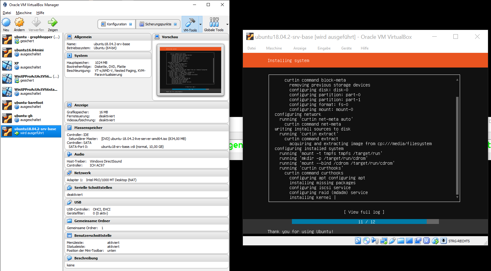

# Ubuntu Server Setup in VirualBox

- ubuntu 18.04.02 + 1GB Ram , 10 GB HDD
- keyboard GER 
- openssh 
- update 

        sudo apt-get update
        sudo apt-get upgrade 
- VBox Netzwerk NAT-Brücke - NET 10.0.2.X DHCP 
- VBox Netzwerk Netzwerkbrücke für lokale Netz IP 
 

## Tools

    sudo apt install mc 

## Docker

    sudo apt install apt-transport-https ca-certificates curl software-properties-common
    curl -fsSL https://download.docker.com/linux/ubuntu/gpg | sudo apt-key add -
    sudo add-apt-repository "deb [arch=amd64] https://download.docker.com/linux/ubuntu $(lsb_release -cs) stable"
    sudo apt-get update
    apt-cache policy docker-ce
    sudo apt install docker-ce
    sudo systemctl status docker
    docker run hello-world

See: https://www.digitalocean.com/community/tutorials/how-to-install-and-use-docker-on-ubuntu-18-04

### Ubuntu Docker Grafana 

    docker run -d -p 3000:3000 --name=grafana -e "GF_INSTALL_PLUGINS=grafana-clock-panel,grafana-simple-json-datasource" -e "GF_SECURITY_ADMIN_PASSWORD=secret" grafana/grafana
    sudo docker start 055bcc2493ad625be88ff6ab79322b6907027d9014fe463f05dca9961a031261

### Ubuntu docker Prometheus 
    time series database, monitor targets,
    Prometheus will periodically scrap them
    retrieve metrics via HTTP calls

### Ubuntu Docker TSDB 

See:    
    https://devconnected.com/the-definitive-guide-to-influxdb-in-2019/
    https://devconnected.com/the-definitive-guide-to-prometheus-in-2019/

### Push Gateway 
    wget https://github.com/prometheus/pushgateway/releases/download/v0.8.0/pushgateway-0.8.0.linux-amd64.tar.gz
    tar xvzf pushgateway-0.8.0.linux-amd64.tar.gz
    cd pushgateway-0.8.0.linux-amd64/   
    ./pushgateway & 

Pushgateway is listening to incoming metrics on port 9091.

### statsd, collectd

https://github.com/statsd/statsd 

https://collectd.org/ 

### Prometheus 

https://www.oreilly.com/library/view/prometheus-up/9781492034131/ch01.html

https://www.oreilly.com/library/view/prometheus-up/9781492034131/ch04.html

https://prometheus.io/docs/prometheus/latest/installation/ 

    wget https://github.com/prometheus/prometheus/releases/download/v2.15.2/prometheus-2.15.2.linux-amd64.tar.gz 

    tar xvzf prometheus-2.9.2.linux-amd64.tar.gz

    nano prometheus.yml

global:

    scrape_interval:     1s # Set the scrape interval to every 1 second.

static_configs:
  
    targets: ['localhost:9090', 'localhost:9091']

### Pushgateway

    wget https://github.com/prometheus/pushgateway/releases/download/v0.8.0/pushgateway-0.8.0.linux-amd64.tar.gz
    tar xvzf pushgateway-0.8.0.linux-amd64.tar.gz
    cd pushgateway-0.8.0.linux-amd64/
    ./pushgateway & 

Bash Skript 

    #!/bin/bash
    z=$(ps aux)
    while read -r z
    do
       var=$var$(awk '{print "cpu_usage{process=\""$11"\", pid=\""$2"\"}", $3z}');
    done <<< "$z"
    curl -X POST -H  "Content-Type: text/plain" --data "$var
    " http://localhost:9091/metrics/job/top/instance/machine

Start 
    while sleep 1; do ./better-top; done;

http://192.168.4.26:9090/graph 

---

    docker run -p 9090:9090 prom/prometheus

## Graylog 

<https://www.graylog.org/> 
<https://hub.docker.com/r/graylog/graylog/>

<https://docs.graylog.org/en/3.1/pages/installation/docker.html#here>
<https://packages.graylog2.org/appliances/ova>

## ELK 

<https://github.com/pschiffe/rsyslog-elasticsearch-kibana> 

### Kibana

<https://www.elastic.co/guide/en/kibana/current/docker.html>

### ElasticSearch 

<https://hub.docker.com/_/elasticsearch/>

<https://www.elastic.co/guide/en/elasticsearch/reference/7.5/docker.html>
<https://github.com/elastic/elasticsearch>

<https://opendistro.github.io/for-elasticsearch-docs/docs/install/docker/>
<https://github.com/dockerfile/elasticsearch>
<https://elk-docker.readthedocs.io/> 

### ElasticSearch Docker

<https://github.com/bahaaldine/docker-elasticsearch>

# Creating Your Docker Images
In this section, I'll explain in detail how to create one of your architecture application's Docker image. You
will see that the overall procedure is the same for every other application, so I'll describe the creation of
just one.
For reference, you can find all the images on my GitHub repositories.
* Elasticsearch: https://github.com/bahaaldine/docker-elasticsearch
* Logstash: https://github.com/bahaaldine/docker-logstash
+ Logstash Forwarder: https://github.com/bahaaldine/dockerlogstash-forwarder
* Kibana: https://github.com/bahaaldine/docker-kibana
* Zookeeper: https://github.com/bahaaldine/docker-zookeeper
* Apache Kafka: https://github.com/bahaaldine/docker-kafka
* Apache Zookeeper for Kafka: <https://github.com/bahaaldine/docker-zookeeper>
* Apache Spark: <https://github.com/bahaaldine/docker-spark>

Let's now focus on creating an Elasticsearch Docker image and walking through the Dockerfile file,
available here:
<https://github.com/bahaaldine/docker-elasticsearch/blob/master/Dockerfile>

