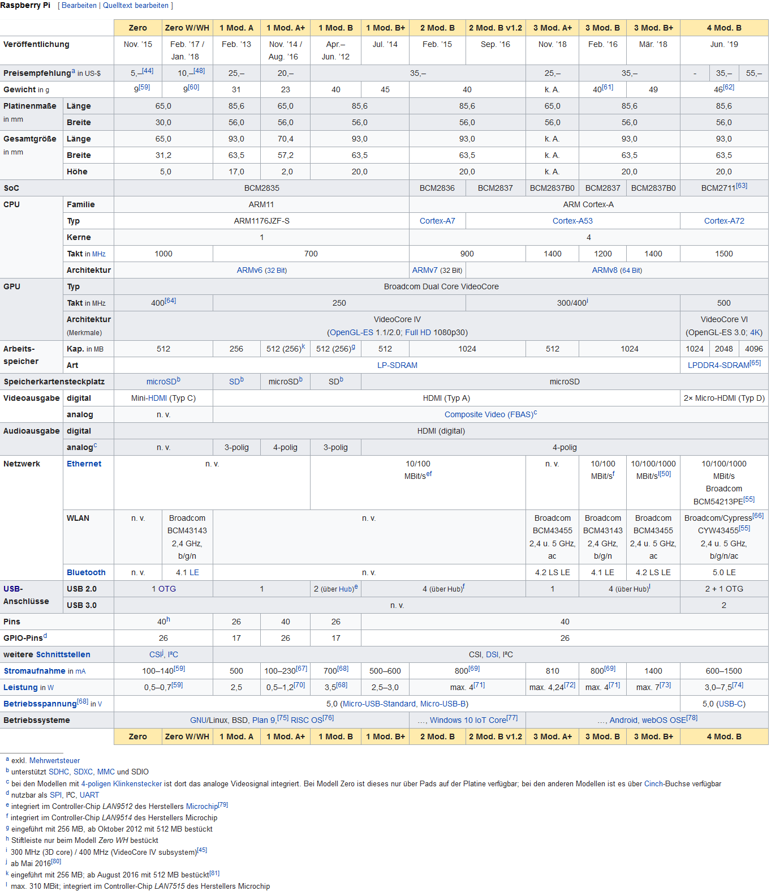
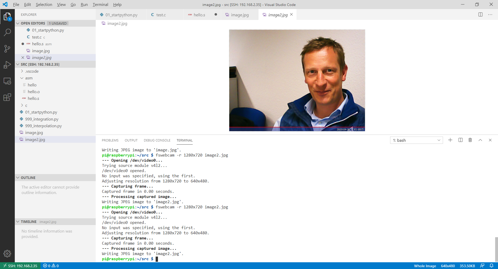

---
layout: post
title: "Project Raspberry Pi Zero EDUcation"
categories: [EDU]
tags: [Raspi, Education, Onboarding, LED, Coding]
--- 
Raspi startup for Education : connected traffic lights 

# Project Raspberry Pi Zero EDUcation  

    4-5 Gruppen, (Analog-Schalter, Ampel 1-4)
    5 Raspi , MicroSD-Karte , 
    5 x Stromversorgung 
    Netzterkverbindung ,
    1 WLAN - Router + IP + DHCP 
    5 x 3 LEDs (Rot / Gelb / Grün ) mit Vorwiederstand , 
    3 x 5 Verbindungskabel LED 
    5 x Schalter 

    Software:
    ISO Image Rasberian 
    ISO Image Config : + Client Wlan zum WLANRouter + SSH-Server + RDP - Server, VPN Server 
    Putty + Winscp + RDP Client / REal - VNC Client 

# Plan B Raspi 3 B oder Raspi 4 


# Plan Story

Messen von Signalen und steuern Ampel - LED - Signal 

## Western Electric Rules - Anomalie - Erkennung 

<https://orangematter.solarwinds.com/2013/06/26/4-statistical-process-control-rules-that-detect-anomalies-in-systems/>

<https://www.qimacros.com/control-chart/western-electric-rules/> 

## 3 LEDs

An / Aus, langsam blinken / schnell blinken 

## Sensor 

- Phyphox  3 Achsen 

## Raspberry Pi Spec 

Raspi Specs  <https://www.reichelt.de/bilder/_LP/LP/2018-02_Entwicklerboards/Tabelle_EB.pdf?&trstct=lp_1358_143268>



### Pi Zero Spec 

<https://raspberry-projects.com/pi/pi-hardware/raspberry-pi-zero/raspberry-pi-zero-hardware-general-specifications>

<https://www.raspberrypi.org/products/raspberry-pi-zero-w/>

Broadcom BCM2835.  This contains an ARM1176JZFS (ARM11 using an ARMv6-architecture core) with floating point, running at 1GHz, and a Videocore 4 GPU. 
 
    Armv6 - wird leider (noch ) nicht von VS Code unterstützt

Raspberry Pi Zero W will remain in production until at least January 2026


## SSH
  
Datei mit dem Namen "**SSH**" anlegen 

## WLAN - Wireless LAN 

- kein Kabel ebötigt
- 

### WLAN Router 

Setup Router / UMTS - Router mit Handy und Sim 

Netzwerk Einstellungen - lokales Netz - Netzwerktopologie - DHCP-Server + Adress Range  - Route
z.B. IP 192.168.1.1 / SubNetMask 255.255.255.0 
oder 10.0.0.1 / 255.0.0.0 

Wlan SSID setzen "PIWLAN"  - Passwort setzen "PaSSWoRd" - ignore 5Ghz - use 2.4 Ghz - Use WPA-PSK 


### WLAN Raspi 

<https://pi-buch.info/wlan-schon-vor-der-installation-konfigurieren/>

Datei mit dem Namen "**wpa_supplicant.conf**" anlegen mit UNIX (LF) mit 

    country=DE 
    ctrl_interface=DIR=/var/run/wpa_supplicant GROUP=netdev 
    update_config=1 
    network={
         ssid="PIWLAN"
         scan_ssid=1
         psk="PaSSWoRd"
         key_mgmt=WPA-PSK
    }


check - tools

    ifconfig
    sudo apt-get install iw
    iwlist chan
    dmesg

### SSH Raspi 

SSH - Enable : Datei .ssh auf dem Image erzeugen

## ssh putty

login: pi, pass: raspberry 

## mc

sudo apt-get install mc


## RDP 

optional: 
   
    

xrdp RDP server 

    sudo apt-get install xrdp

optional 

    sudo reboot

### RDP Clients 

Linux <http://www.rdesktop.org/>

Mac OS X <https://itunes.apple.com/de/app/microsoft-remote-desktop/id715768417?mt=12>

## Code 

Remote Debugging <https://www.hanselman.com/blog/RemoteDebuggingWithVSCodeOnWindowsToARaspberryPiUsingNETCoreOnARM.aspx>

### VS CODE Remote Dev Extension 

(funktioniert leider (noch ) nicht auf Raspi Zero (Arm V6)) soll März 2020 kommen 

<https://code.visualstudio.com/docs/remote/remote-overview>

<https://marketplace.visualstudio.com/items?itemName=ms-vscode-remote.vscode-remote-extensionpack>


<https://github.com/microsoft/vscode-remote-release/issues/2493>

<https://github.com/microsoft/vscode-remote-release/issues/669>

### Pinbelegung 

    pinout 


Interactive Pinout <https://pinout.xyz/pinout/>

## RasPi Asm 
    @
    @ Assembler program to print "Hello World!"
    @ to stdout. 
    @ R0-R2- parameters to linux function service
    @ R7- linux function number
    @

    .global _start                  @ Provide program starting@ address to linker

    @ Set up the parameters to print hello world
    @ and then call Linux to do it.

    _start: 
        mov R0, #1                  @ 1 = StdOut 
        ldr R1, =helloworld         @ string to print, Load Register R1 with adress of string helloworld 
        mov R2, #13                 @ length of our string, Move number 13 into Register 2
        mov R7, #4                  @ linux write system call, Move number 4 into Register R7 
        svc 0                       @ Call linux to print, send control to interupt handler in linux kernel and interpret Register 

    @ Set up the parameters to exit the program
    @ and then call Linux to do it.
        mov R0, #0                  @ Use 0 return code
        mov R7, #1                  @ Service command code 1
                                    @ terminates this program
        svc 0                       @ Call linux to terminate
    .data                                   @ Data Section
    helloworld: .ascii "Hello World!\n"     @ Ascii - Text - Data 

``` bash 
as -o hello.o hello.s
ld -o hello hello.o 
.\hello 
objdump -s -d hello.o


```


## USB Video 

    sudo apt install fswebcam
    fswebcam image.jpg
    fswebcam -r 1280x720 image2.jpg
    fswebcam -r 1280x720 --no-banner image3.jpg



<https://www.raspberrypi.org/documentation/usage/webcams/>

## Python 2 / 3 

Nicht genutzt: python -> python 2

aktuell benutzt: python3 -> python 3 , pip3 


### Jupyter 

pip3 install jupyterlab


### Python Web Socket Server 

Einfacher Echo - Server 

    #!/usr/bin/env python3

    ## Working  2020-05-05, https://realpython.com/python-sockets/#tcp-sockets

    import socket

    HOST = '127.0.0.1'  # Standard loopback interface address (localhost)
    PORT = 65432        # Port to listen on (non-privileged ports are > 1023)

    with socket.socket(socket.AF_INET, socket.SOCK_STREAM) as s:
        s.bind((HOST, PORT))
        s.listen()
        while True:
            conn, addr = s.accept()
            with conn:
                print('Connected by', addr)
                while True:
                    data = conn.recv(1024)
                    if not data:
                        break
                    print ("Data: " , data)
                    conn.sendall(data)


### Python Web Socket Client 
    import socket

    #c = socket.socket()
    clientsocket = socket.socket(socket.AF_INET, socket.SOCK_STREAM)

    clientsocket.connect (("www.google.com", 80))

    reqest = "GET / HTTP/1.1\n\n"

    clientsocket.sendall (bytes(reqest, "ascii"))

    i=0
    while True:

        data = clientsocket.recv(40960)
        if not data: 
            break

        i +=1
        print(i, data) 
        if b"</html>" in data:
            break


### Python WebLed-Code 

~~~PY
    import RPi.GPIO as GPIO
    import time


    from http.server import BaseHTTPRequestHandler, HTTPServer
    import time


    print ("EDU - AMPEL") 
    print ("RPi: " , GPIO.RPI_REVISION, GPIO.RPI_INFO )
    # Webserver 


    hostName = "0.0.0.0"
    hostPort = 8000
    GPIO.setmode(GPIO.BCM) 
    isGruen = False

    def setLED (rot, gelb, gruen):
	    GPIO.setmode(GPIO.BCM) 
	    GPIO.setup(4, GPIO.OUT)
	    isGruen = gruen
	    if gruen :
		
		
		    GPIO.output (4, True)
	    else:
		    GPIO.output (4, False)
		
    class MyServer(BaseHTTPRequestHandler):
        def do_GET(self):
            self.send_response(200)
            self.send_header("Content-type", "text/html")
            self.end_headers()
            self.wfile.write(bytes('<html><head> <meta charset="UTF-8"><title>Title goes here.</title></head>', "utf-8"))
            self.wfile.write(bytes("<body><p>Webserver Response</p>", "utf-8"))
            self.wfile.write(bytes("<p>You accessed path: %s</p>" % self.path, "utf-8"))
        
            if ("gruen" in self.path):
                setLED(0,0,1)
                self.wfile.write(bytes("<p> %s</p>" % "Grün", "utf-8"))
            else:
                setLED(0,0,0)
                self.wfile.write(bytes("</body></html>", "utf-8"))

    myServer = HTTPServer((hostName, hostPort), MyServer)
    print(time.asctime(), "Server Starts - %s:%s" % (hostName, hostPort))

    try:
        myServer.serve_forever()
    except KeyboardInterrupt:
        pass

    myServer.server_close()
    print(time.asctime(), "Server Stops - %s:%s" % (hostName, hostPort))
    GPIO.cleanup()
~~~


~~~Python
import RPi.GPIO as GPIO
import time


from http.server import BaseHTTPRequestHandler, HTTPServer
import time


print ("EDU - AMPEL")  
print ("RPi: " , GPIO.RPI_REVISION, GPIO.RPI_INFO )

# Webserver 

hostName = "0.0.0.0"
hostPort = 8000
GPIO.setmode(GPIO.BCM) 
isGruen = False

def setLED (rot, gelb, gruen):
    GPIO.setmode(GPIO.BCM) 
    GPIO.setup(4, GPIO.OUT)
    isGruen = gruen
    if gruen :
        GPIO.output (4, True)
    else:
        GPIO.output (4, False)
    
class MyServer(BaseHTTPRequestHandler):
    def do_GET(self):


        print ("INFO:", self.client_address, self.path ) 

        self.send_response(200)
        self.send_header("Content-type", "text/html")
        self.end_headers()
        self.wfile.write(bytes('<html><head> <meta charset="UTF-8"><title>Ampel</title>', "utf-8"))
        style ="""
            <style>
        body {
            background-color: lightgrey;
        }

        h1 {
            color: red;
        }

        p {
            color: blue;
            font-family: Arial, Helvetica, sans-serif;
        }

        .circle {
            height: 50px;
            width: 50px;
            border-radius: 50%;
        }

        .button {
            background-color: #4caf50;
            border: none;
            color: white;
            padding: 20px;
            text-align: center;
            text-decoration: none;
            display: inline-block;
            font-size: 16px;
            margin: 4px 2px;
        }
    </style>
        """
        self.wfile.write(bytes(style, "utf8"))
        self.wfile.write(bytes('</head>', "utf-8"))
        self.wfile.write(bytes("<body><p>Webserver Response</p>", "utf-8"))
        self.wfile.write(bytes("<p>You accessed path: %s</p>" % self.path, "utf-8"))
        htmlform = """
    <form action="send" method="GET">
        <label>Ampel 1:</label><br />
        <div class="circle" style="background-color: orangered;"></div><br>
        <div class="circle" style="background-color: yellow;"></div><br>
        <div class="circle" style="background-color: greenyellow;"></div><br>
        <input name="inp" id="inp" class="button" type="submit" value="Press"
            style="background-color: gray; border-radius: 50%;" /><br>
    </form>
        """

        self.wfile.write(bytes(htmlform, "utf8"))

        if ("gruen" in self.path):
            setLED(0,0,1)
            self.wfile.write(bytes("<p> %s</p>" % "Grün", "utf-8"))
        else:
            setLED(0,0,0)
        
        self.wfile.write(bytes("</body></html>", "utf-8"))

myServer = HTTPServer((hostName, hostPort), MyServer)
print(time.asctime(), "Server Starts - %s:%s" % (hostName, hostPort))

try:
    myServer.serve_forever()
except KeyboardInterrupt:
    pass # ^z 

myServer.server_close()
print(time.asctime(), "Server Stops - %s:%s" % (hostName, hostPort))
GPIO.cleanup()
~~~

# SmartSim Anwendung auf Raspi 


---


# das Netzteil ...

<https://www.elektronik-kompendium.de/sites/raspberry-pi/1912111.htm >


# Links

<https://developer-blog.net/raspberry-pi-gpio-schnittstelle-teil-1/ >
