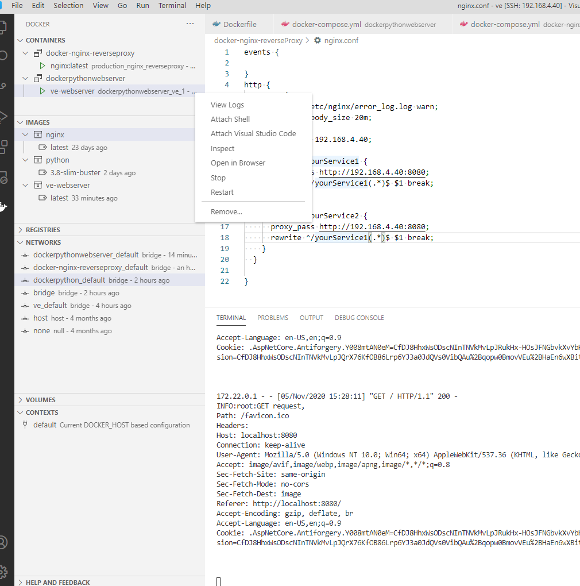

---
layout: post
title:  Docker Nginx Reverse Proxy 
categories: [Docker, Nginx, Reverse Proxy]
tags: [Docker, Nginx, Reverse Proxy]
---
Beispiel für 2 Docker container. Einen Werserver mit Python, einen Nginx Reverseproxy in einem VS Code mi Docker Plugin

# Docker Nginx Reverse Proxy - Simple in VS Code

Beispiel für 2 Docker container. Einen Werserver mit Python, einen Nginx Reverseproxy in einem VS Code mi Docker Plugin 



## docker python webserver für port 8080

### webserver.py

webserver.py

``` python
    #!/usr/bin/env python3
    """
    Very simple HTTP server in python for logging requests
    Usage::
        ./server.py [<port>]
    """
    from http.server import BaseHTTPRequestHandler, HTTPServer
    import logging
    import socket

    class S(BaseHTTPRequestHandler):
        def _set_response(self):
            self.send_response(200)
            self.send_header('Content-type', 'text/html')
            self.end_headers()

        def do_GET(self):
            logging.info("GET request,\nPath: %s\nHeaders:\n%s\n", str(self.path), str(self.headers))
            self._set_response()
            self.wfile.write("GET request for {}".format(self.path).encode('utf-8'))

        def do_POST(self):
            content_length = int(self.headers['Content-Length']) # <--- Gets the size of data
            post_data = self.rfile.read(content_length) # <--- Gets the data itself
            logging.info("POST request,\nPath: %s\nHeaders:\n%s\n\nBody:\n%s\n",
                    str(self.path), str(self.headers), post_data.decode('utf-8'))

            self._set_response()
            self.wfile.write("POST request for {}".format(self.path).encode('utf-8'))

    def run(server_class=HTTPServer, handler_class=S, port=8080):
        logging.basicConfig(level=logging.INFO)
        server_address = ('', port)
        httpd = server_class(server_address, handler_class)
        logging.info('Starting httpd...\n')
        try:
            httpd.serve_forever()
        except KeyboardInterrupt:
            pass
        httpd.server_close()
        logging.info('Stopping httpd...\n')

    if __name__ == '__main__':

        hostname = socket.gethostbyname(socket.gethostname())

        print ("Start ", __file__, "on", hostname) 
    
        from sys import argv
    
        if len(argv) == 2:
            run(port=int(argv[1]))
        else:
            run()
```

### Webserver Dockerfile

Datei Dockerfile

``` Dockerfile
  FROM python:3.8-slim-buster
  WORKDIR /usr/src/app

  # COPY requirements.txt ./
  # RUN pip install --no-cache-dir -r requirements.txt
  COPY . . 

  CMD [ "python", "webserver.py" ]

```

### Webserver docker-compose.yml

Datei docker-compose.yml
``` yml
    version: '3.8'

    services:
      ve:
        image: ve-webserver
        build:
          context: .
          dockerfile: ./Dockerfile
        ports:  
          - "8080:8080"
```

### Erstellen und starten des Webserver Images 

    Executing task: docker-compose -f "dockerpythonwebserver/docker-compose.yml" up -d --build <

-

    Creating network "dockerpythonwebserver_default" with the default driver
    Building ve
    Step 1/4 : FROM python:3.8-slim-buster
     ---> 0f59d947500d
    Step 2/4 : WORKDIR /usr/src/app
     ---> Using cache
     ---> 09d2910a72a3
    Step 3/4 : COPY . .
     ---> ae28ea2c351a
    Step 4/4 : CMD [ "python", "webserver.py" ]
     ---> Running in ab4cc0588cb8
    Removing intermediate container ab4cc0588cb8
     ---> 82dc8730c707

    Successfully built 82dc8730c707
    Successfully tagged ve-webserver:latest
    Creating dockerpythonwebserver_ve_1 ... done

### Log des Webservers 
    
Start Request:     

    http://192.168.4.40:8080/jhfdsgaksdjfhagsdkf%20jasdfk

Anzeigen des Logs: 

    docker logs -f be0167a622dbae65ef10722d8c7b9cbf559cb93d2d596732ee2a789565799bd6 

    INFO:root:Starting httpd...

    192.168.4.29 - - [05/Nov/2020 14:57:45] code 400, message Bad request version ('\x00$\x13\x01\x13\x03\x13\x02À+À/̨̩À,À0À')
    192.168.4.29 - - [05/Nov/2020 14:57:45] "ü{.ö@þѶR£Ò;$&åå×æ2EÒ  Úá Õù9¾E.Ñ£Þ(Ã{ îÅaàÆ\ÓïÁʤ
    $À+À/̨̩À,À0À" 400 -
    INFO:root:GET request,
    Path: /jhfdsgaksdjfhagsdkf%20jasdfk
    Headers:
    Host: 192.168.4.40:8080
    User-Agent: Mozilla/5.0 (Windows NT 10.0; Win64; x64; rv:82.0) Gecko/20100101 Firefox/82.0
    Accept: text/html,application/xhtml+xml,application/xml;q=0.9,image/webp,*/*;q=0.8
    Accept-Language: de,en-US;q=0.7,en;q=0.3
    Accept-Encoding: gzip, deflate
    Connection: keep-alive
    Upgrade-Insecure-Requests: 1

## docker compose Nginx reverse Proxy 


### nginx.config 

Nginx Konfigurationsdatei nginx.conf

    events {

    }
    http {
      server {
        error_log /etc/nginx/error_log.log warn;
        client_max_body_size 20m;
    
        server_name 192.168.4.40;

        location /yourService1 {
          proxy_pass http://192.168.4.40:8080;
          rewrite ^/yourService1(.*)$ $1 break;
        }

        location /yourService2 {
          proxy_pass http://192.168.4.40:8080;
          rewrite ^/yourService1(.*)$ $1 break;
        }
      }

    }

### nginx docker-compose.yml 

Datei docker-compose.yml 

    version: '3'
    services:
      nginx: 
        image: ve-nginx-reverseproxy:latest
        container_name: production_nginx
        volumes:
          - ./nginx.conf:/etc/nginx/nginx.conf
        ports:
          - 80:80
          - 443:443
      
### bauen und starten von ve-nginx-reverseproxy Image 

Compose up 

    Executing task: docker-compose -f "docker-nginx-reverseProxy/docker-compose.yml" up -d --build 

__

    Pulling nginx (nginx:latest)...
    latest: Pulling from library/nginx
    Digest: sha256:ed7f815851b5299f616220a63edac69a4cc200e7f536a56e421988da82e44ed8
    Status: Downloaded newer image for nginx:latest
    Creating production_nginx_reverseproxy ... done


### Test Port 80 log 


    docker logs -f c8d1187f9f72e082a8c205098f3192547ef33809a600d3431d4e4143c50b040d <

Test Request für Reverseproxy 

    http://192.168.4.40:80/yourService1/1
    http://192.168.4.40:80/yourService2/1

Log nginx reverseproxy: 

    /docker-entrypoint.sh: /docker-entrypoint.d/ is not empty, will attempt to perform configuration
    /docker-entrypoint.sh: Looking for shell scripts in /docker-entrypoint.d/
    /docker-entrypoint.sh: Launching /docker-entrypoint.d/10-listen-on-ipv6-by-default.sh
    10-listen-on-ipv6-by-default.sh: Getting the checksum of /etc/nginx/conf.d/default.conf
    10-listen-on-ipv6-by-default.sh: Enabled listen on IPv6 in /etc/nginx/conf.d/default.conf
    /docker-entrypoint.sh: Launching /docker-entrypoint.d/20-envsubst-on-templates.sh
    /docker-entrypoint.sh: Configuration complete; ready for start up
    192.168.4.29 - - [05/Nov/2020:15:18:05 +0000] "GET /yourService1/1 HTTP/1.1" 200 29 "-" "Mozilla/5.0 (Windows NT 10.0; Win64; x64; rv:82.0) Gecko/20100101 Firefox/82.0"
    192.168.4.29 - - [05/Nov/2020:15:18:05 +0000] "GET /favicon.ico HTTP/1.1" 404 153 "http://192.168.4.40/yourService1/1" "Mozilla/5.0 (Windows NT 10.0; Win64; x64; rv:82.0) Gecko/20100101 Firefox/82.0"
    192.168.4.29 - - [05/Nov/2020:15:18:42 +0000] "GET /yourService2/1 HTTP/1.1" 200 42 "-" "Mozilla/5.0 (Windows NT 10.0; Win64; x64; rv:82.0) Gecko/20100101 Firefox/82.0"


Log Webserver 

    INFO:root:Starting httpd...

    INFO:root:GET request,
    Path: /aa
    Headers:
    Host: 192.168.4.40:8080
    User-Agent: Mozilla/5.0 (Windows NT 10.0; Win64; x64; rv:82.0) Gecko/20100101 Firefox/82.0
    Accept: text/html,application/xhtml+xml,application/xml;q=0.9,image/webp,*/*;q=0.8
    Accept-Language: de,en-US;q=0.7,en;q=0.3
    Accept-Encoding: gzip, deflate
    Connection: keep-alive
    Upgrade-Insecure-Requests: 1


    192.168.4.29 - - [05/Nov/2020 15:16:13] "GET /aa HTTP/1.1" 200 -
    INFO:root:GET request,
    Path: /1
    Headers:
    Host: 192.168.4.40:8080
    Connection: close
    User-Agent: Mozilla/5.0 (Windows NT 10.0; Win64; x64; rv:82.0) Gecko/20100101 Firefox/82.0
    Accept: text/html,application/xhtml+xml,application/xml;q=0.9,image/webp,*/*;q=0.8
    Accept-Language: de,en-US;q=0.7,en;q=0.3
    Accept-Encoding: gzip, deflate
    Upgrade-Insecure-Requests: 1


    172.22.0.1 - - [05/Nov/2020 15:18:05] "GET /1 HTTP/1.0" 200 -
    INFO:root:GET request,
    Path: /yourService2/1
    Headers:
    Host: 192.168.4.40:8080
    Connection: close
    User-Agent: Mozilla/5.0 (Windows NT 10.0; Win64; x64; rv:82.0) Gecko/20100101 Firefox/82.0
    Accept: text/html,application/xhtml+xml,application/xml;q=0.9,image/webp,*/*;q=0.8
    Accept-Language: de,en-US;q=0.7,en;q=0.3
    Accept-Encoding: gzip, deflate
    Upgrade-Insecure-Requests: 1


# src 

</src/2020-11-docker/>


# Links:


https://www.domysee.com/blogposts/reverse-proxy-nginx-docker-compose 

server.py

https://gist.github.com/mdonkers/63e115cc0c79b4f6b8b3a6b797e485c7

MS VS Code How TO 
https://docs.microsoft.com/en-us/visualstudio/docker/tutorials/update-your-app 

MS VS Code Docker Debug Python 

https://code.visualstudio.com/docs/containers/debug-python 

## rescue 
### nginx.conf 

events {

}
http {
    server {  
        error_log /etc/nginx/error_log.log warn; 
        client_max_body_size 20m;
        ## 
        server_name 192.168.2.46;

        location /basic_status {
           stub_status on;
           allow all;
        }

        # location 1 
        location /yourService1 {
            proxy_pass http://192.168.2.46:8080;
            rewrite ^/yourService1(.*)$ $1 break;
        }

        # location cut3d (TODO) 
        location /cut3d {
            proxy_pass http://192.168.2.46:8080;
            rewrite ^/cut3d(.*)$ rewrite-$1 break;
        }
    }

}

### promentheus.conf

global:
  scrape_interval:     2s
  evaluation_interval: 2s

rule_files:
  # - "first.rules"
  # - "second.rules"

scrape_configs:
  # selbst 
  - job_name: prometheus
    static_configs:
      - targets: ['localhost:9090']

  - job_name: 'node'
    static_configs:
      - targets: ['192.168.2.46:9100']


