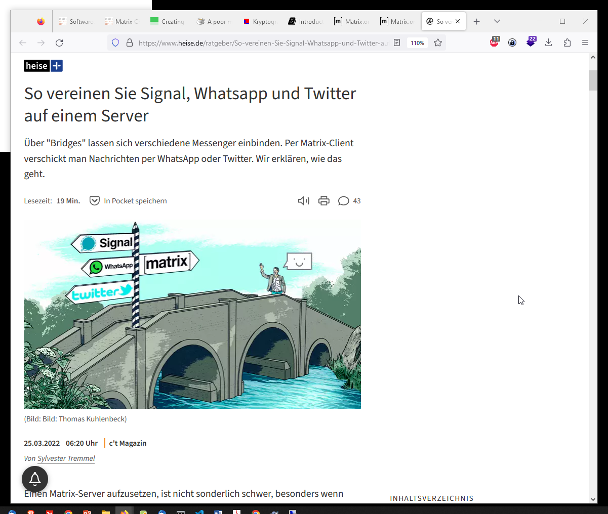
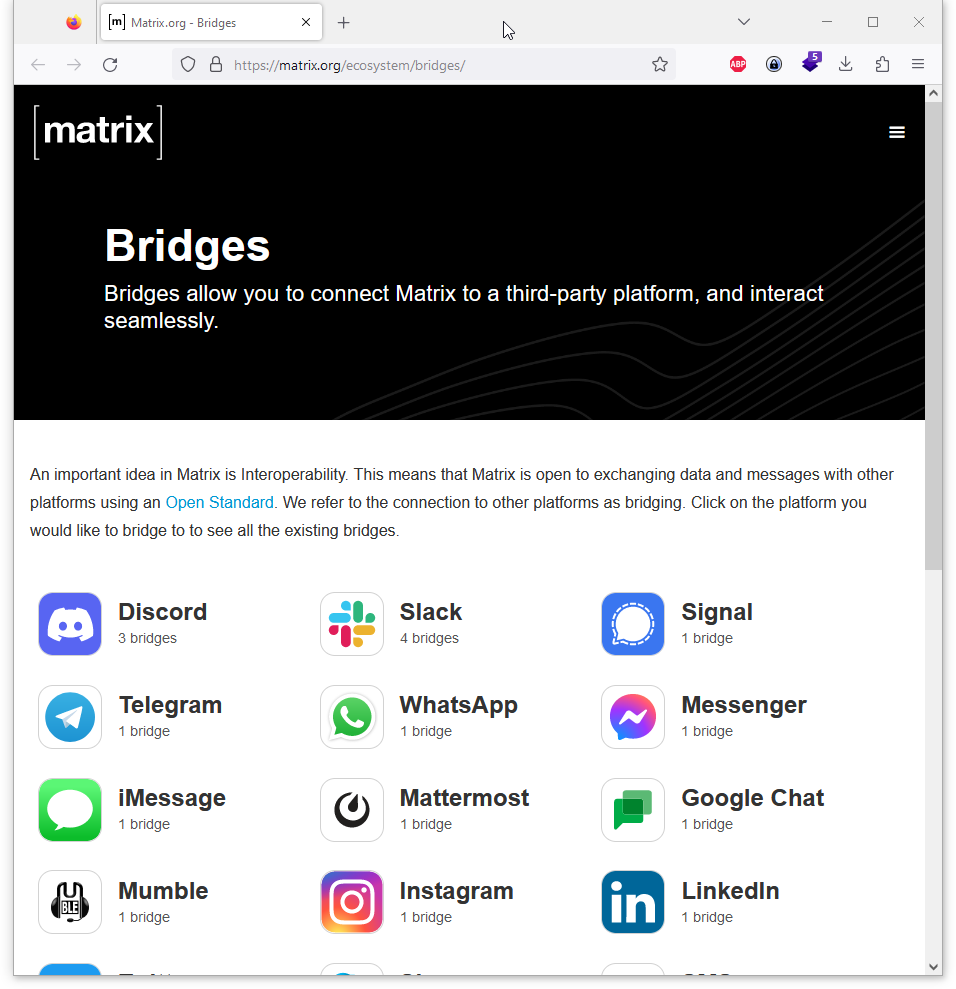
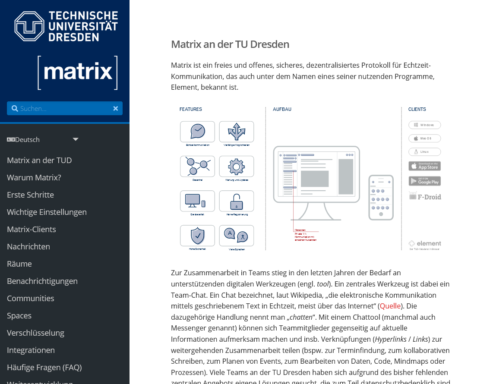

- [Matrix Chat](#matrix-chat)
  - [Cross Messaging Protokoll](#cross-messaging-protokoll)
- [Links](#links)
  - [Bridges](#bridges)
  - [Clients](#clients)
  - [Dockers](#dockers)
- [Matrix Homeserver Synapse](#matrix-homeserver-synapse)
- [Dendrite Homeserver](#dendrite-homeserver)
- [SSL - test](#ssl---test)
- [Jitsi Meet Server mit ubuntu und nginx](#jitsi-meet-server-mit-ubuntu-und-nginx)

# Matrix Chat 
An open network for secure, decentralised communication

A matrix chat, also known as Matrix protocol or Matrix network, is an open standard for decentralized, secure, and interoperable communication. It provides a framework for real-time communication, allowing users to send messages, make voice or video calls, share files, and collaborate in a distributed manner.

The Matrix protocol is designed to address some of the limitations and fragmentation observed in existing communication platforms. It enables communication across different servers or networks, ensuring that users on one server can communicate seamlessly with users on other servers, regardless of the underlying technology or service provider.

Here are some key aspects of Matrix chat:

1. Decentralization: Matrix is a decentralized network, which means there is no central server controlling the entire communication infrastructure. Instead, communication is distributed across multiple servers, giving users more control over their data and reducing the risk of service disruptions.

2. Federation: Matrix uses a federation model where servers interconnect with each other to form a global communication network. This federation allows users on different servers to communicate with each other as if they were on the same server. Federation ensures that messages and other data can traverse across server boundaries.

3. End-to-End Encryption: Matrix supports end-to-end encryption (E2EE), providing secure and private communication. E2EE ensures that only the intended recipients can decrypt and read messages, preventing unauthorized access or surveillance.

4. Bridging: Matrix allows bridging with other communication networks, such as IRC, Slack, or Discord. This means that Matrix users can connect and communicate with users on other platforms, even if they are not directly using Matrix.

5. Extensibility: Matrix is designed to be extensible, allowing developers to build additional features, integrations, or customizations on top of the protocol. This flexibility enables the integration of Matrix chat with other services and applications, expanding its functionality.

6. Open Standard: Matrix is an open standard, with its specification and reference implementations available to the public. This openness promotes transparency, collaboration, and innovation, allowing anyone to participate in the development and improvement of the protocol.

Matrix chat offers a promising alternative to centralized communication platforms by providing a decentralized and interoperable framework. It aims to empower users with more control over their data, foster secure communication, and facilitate collaboration across different networks and services.

## Cross Messaging Protokoll 

# Links

https://www.heise.de/ratgeber/So-vereinen-Sie-Signal-Whatsapp-und-Twitter-auf-einem-Server-6604638.html?seite=all
https://www.heise.de/ratgeber/Eigener-Chatserver-Mit-dem-Matrix-Server-einen-Messaging-Dienst-betreiben-6289020.html

https://docs.mau.fi/bridges/index.html

## Bridges 
<https://matrix.org/bridges/>
## Clients 
<https://matrix.org/clients/>

## Dockers 
https://github.com/spantaleev/matrix-docker-ansible-deploy
https://www.ansible.com/
https://github.com/spantaleev/matrix-docker-ansible-deploy/blob/master/docs/container-images.md

https://github.com/spantaleev/matrix-docker-ansible-deploy/blob/master/docs/README.md

# Matrix Homeserver Synapse 
https://github.com/matrix-org/synapse

https://matrix.org/docs/guides/#installing-synapse
https://decatec.de/home-server/matrix-synapse-auf-ubuntu-server-20-04-lts-mit-nginx-postgresql-und-lets-encrypt/

# Dendrite Homeserver
Dendrite is a second-generation Matrix homeserver written in Go. It intends to provide an efficient, reliable and scalable alternative to Synapse:
https://github.com/matrix-org/dendrite 

# SSL - test 
https://www.ssllabs.com/ssltest/

https://doc.matrix.tu-dresden.de/

# Jitsi Meet Server mit ubuntu und nginx
<https://decatec.de/home-server/jitsi-meet-videokonferenz-system-unter-ubuntu-server-mit-nginx/>