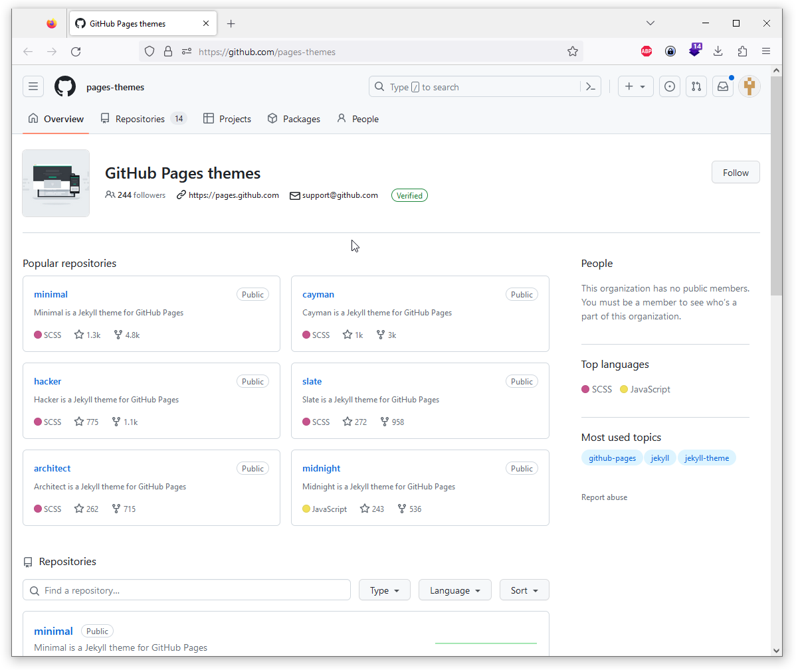

# Supported Themes 2

Jekyll is a popular static site generator that allows you to build and host websites directly from your GitHub repositories.

GitHub Pages is a feature provided by GitHub that allows you to create a website for your GitHub repositories, user account, or organization. It can be used to showcase your projects, create documentation, or publish a personal blog.

With Jekyll, you can easily create a static website by writing your content in Markdown, a lightweight markup language, and using predefined templates and layouts. Jekyll will take your content and generate a static HTML website, which can be hosted using GitHub Pages.

A "theme" in Jekyll refers to a collection of layout files, stylesheets, and assets that determine the visual appearance and layout of your Jekyll site. Themes provide a consistent design and structure for your website, allowing you to focus on creating content without worrying about the overall look and feel.

GitHub Pages supports Jekyll themes by allowing you to specify a theme in your repository's configuration file. You can choose from a variety of prebuilt Jekyll themes or create your own custom theme.

By using Jekyll and a theme, you can easily create and customize a static website on GitHub Pages without the need for complex web development. It's a popular choice for developers and individuals who want a simple way to host their websites with minimal setup and maintenance.

## Links 

<https://pages.github.com/themes/>

<https://github.com/pages-themes>

<https://docs.github.com/en/pages/setting-up-a-github-pages-site-with-jekyll/adding-a-theme-to-your-github-pages-site-using-jekyll>
