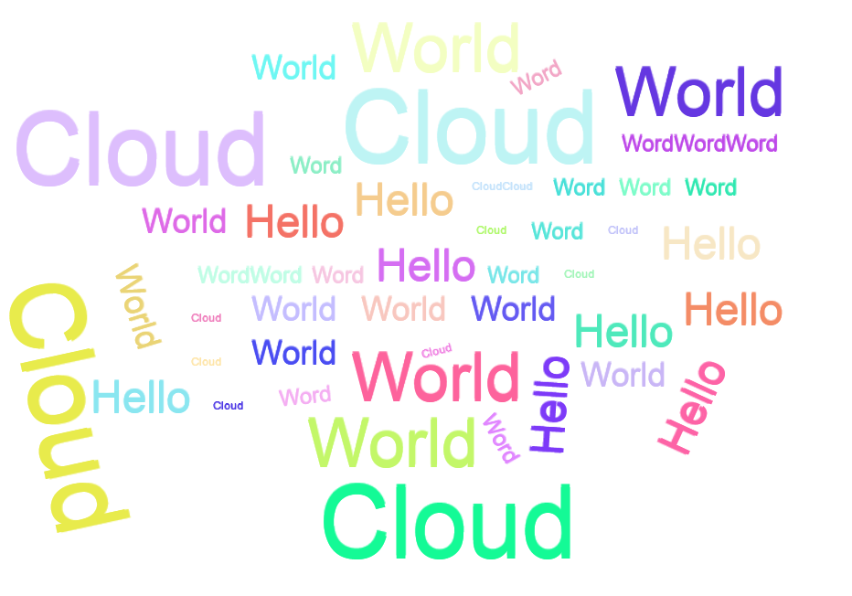

---
layout: post
title: Demo JS Word Cloud 
categories: [JS, Tagcloud]
tags: [builders, JS, Tag, generator]
--- 



- [Vanilla JS Wordcloud](#vanilla-js-wordcloud)
  - [Links](#links)

# Vanilla JS Wordcloud

<https://softwareengel.github.io/html/testword.html>

``` html
<!DOCTYPE html>
<html>

<head>
    <title>Word Cloud Example</title>
    <script src="https://cdn.jsdelivr.net/npm/wordcloud@1.2.2/src/wordcloud2.min.js"></script>

</head>

<body>
    <style>
        .tag-cloud-item:hover {
            color: inherit;
            background: orange;
            text-shadow: 0 0 10px, 0 0 10px #fff, 0 0 10px #fff, 0 0 10px #fff;
            opacity: 0.5;
        }

        .tag-cloud-item a {
            color: inherit;


        }
    </style>

    <div id="html_wordcloud" width="800" height="800" class="canvas"></div>
    <canvas id="canvas_wordcloud" class="word_cloud" width="800" height="800"></canvas>

    <script>
        function scrollToSection(sectionId) {
            var target = document.getElementById(sectionId);
            console.log('scrollToSection: ' + sectionId);
            if (target) {
                target.scrollIntoView({ behavior: 'smooth' });
            }
        }
        function onClick(item) {
            console.log(item);
            scrollToSection(item);
        }
        function onWordHover(item) {
            // Handle the hover event for a word
            if (Array.isArray(item)) {
                console.log('Hovered over: ' + item[0]);
            }
            // Get all elements with the class "tag-cloud-item"
            var tagCloudItems = document.querySelectorAll('.tag-cloud-item');

            // Add a click event to each "tag-cloud-item"
            tagCloudItems.forEach(
                function (tagCloudItem) {
                    tagCloudItem.addEventListener('click', function () {
                    // Action to perform when a tag is clicked

                    scrollToSection(tagCloudItem.textContent);
                });
            });
        }
        var words = [
            { text: 'Hello', size: 40 },{ text: 'World', size: 30 },
            { text: 'World', size: 20 },{ text: 'Cloud', size: 10 }, { text: 'Hello', size: 40 },
            { text: 'World', size: 30 },{ text: 'World', size: 20 },
            { text: 'CloudCloud', size: 10 }, { text: 'Hello', size: 40 },
            { text: 'World', size: 60 },{ text: 'World', size: 20 },
            { text: 'Cloud', size: 90 },{ text: 'World', size: 30 },
            { text: 'WordWord', size: 20 },{ text: 'Cloud', size: 10 }, { text: 'Hello', size: 40 },
            { text: 'World', size: 30 },{ text: 'World', size: 20 },
            { text: 'Cloud', size: 10 }, { text: 'Hello', size: 40 },
            { text: 'World', size: 60 },{ text: 'World', size: 20 },
            { text: 'Cloud', size: 90 }, { text: 'World', size: 30 },
            { text: 'World', size: 20 },{ text: 'Cloud', size: 10 }, { text: 'Hello', size: 40 },{ text: 'World', size: 30 },
            { text: 'World', size: 20 },{ text: 'Cloud', size: 10 }, { text: 'Hello', size: 40 },{ text: 'World', size: 60 },
            { text: 'WordWordWord', size: 20 },{ text: 'Cloud', size: 90 },{ text: 'World', size: 30 },{ text: 'World', size: 20 },{ text: 'Cloud', size: 10 }, { text: 'Hello', size: 40 },{ text: 'World', size: 30 },{ text: 'World', size: 20 },{ text: 'Cloud', size: 10 }, { text: 'Hello', size: 40 },{ text: 'World', size: 60 },{ text: 'World', size: 20 },
            { text: 'Cloud', size: 90 },
            // Add more words and sizes here
        ];

        // color = rep_len(c("skyblue", "blue"))
        /*
            Parameters for wordcloud2 from Rdocumentation
        data - data frame with word and freqency of the word
        size - Font size, default is 1. The larger size means the bigger word
        fontFamily - font used in the word cloud
        fontWeight - Font weight to use, e.g. normal, bold or 600
        color - color of the text, keyword ’random-dark’ and ’random-light’ can be used.
        backgroundColor - Color of the background
        minRotation - If the word should rotate, the minimum rotation (in rad) the text should rotate.
        maxRotation - If the word should rotate, the maximum rotation (in rad) the text should rotate.
        shuffle - Shuffle the points to draw so the result will be different each time for the same list and settings.
        rotateRatio - Probability for the word to rotate. Set the number to 1 to always rotate.
        shape - The shape of the “cloud” to draw. Can be a keyword present.
        widgetsize - size of the widgets
        figPath - The path to a figure used as a mask.
        hoverFunction - Callback to call when the cursor enters or leaves a region occupied by a word. 
        */

        // https://github.com/timdream/wordcloud2.js/blob/gh-pages/API.md
        var options = {
            list: words,
            gridSize: 10, // Adjust the size of the grid
            weightFactor: 5, // Adjust the weight factor
            fontFamily: 'Arial', // Change the font family
            color: 'random-light', // Specify the color scheme
            // color: color    ,
            backgroundColor: '#fff', // Background color
            rotateRatio: 0.5, // Rotate words
        };
        WordCloud.minFontSize = "10px"
        list = [];
        for (var i in words) {
            list.push([words[i]["text"], words[i]["size"]])
        }
        // canvas = document.getElementById('word_cloud')
        // htmlcanvas= document.getElementById('wordcloud')
        // WordCloud(document.getElementById('word_cloud'), {
        WordCloud(
            [
                document.getElementById('canvas_wordcloud'),
                document.getElementById('html_wordcloud'),
            ], {
            list: list,
            // drawOutOfBound: true,
            backgroundColor: '#fff', // Background color
            gridSize: 20, // Adjust the size of the grid
            rotateRatio: 0.2, // Rotate words
            color: 'random-light', // Specify the color scheme
            fontFamily: 'Arial', // Change the font family
            weightFactor: 1, // Adjust the weight factor
            classes: 'tag-cloud-item',
            // drawMask: true,
            hover: (item) => { onWordHover(item) }, // geht  bei canvas und html 
            // "hover": '',
            click: (item) => { onClick(item); } // geht nur bei canvas 
        });

    </script>


    <div id="Hello">


        Hello 1
    </div>
    <div id="World">
        World 1
    </div>

</body>

</html>

```

## Links

<https://www.jasondavies.com/wordcloud/>

<https://www.jqueryscript.net/blog/best-tag-cloud.html>

Beautiful Tag Cloud Generator With Vanilla JS – wordcloud2.js

<https://www.cssscript.com/tag-word-cloud/>

<https://wordcloud2-js.timdream.org/#love>

<https://github.com/timdream/wordcloud2.js>