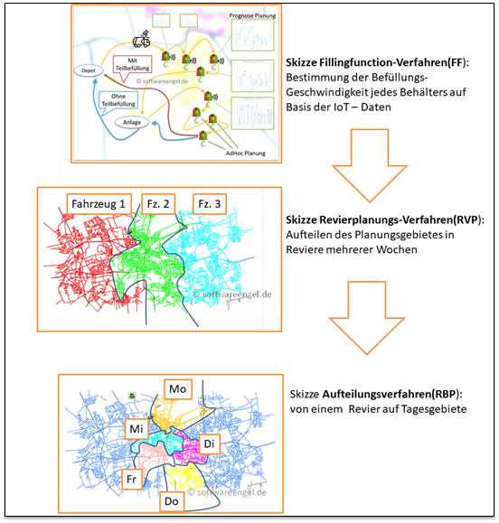
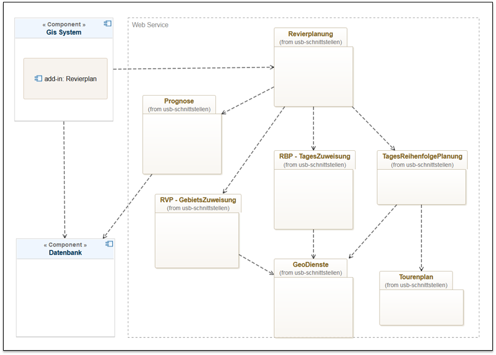
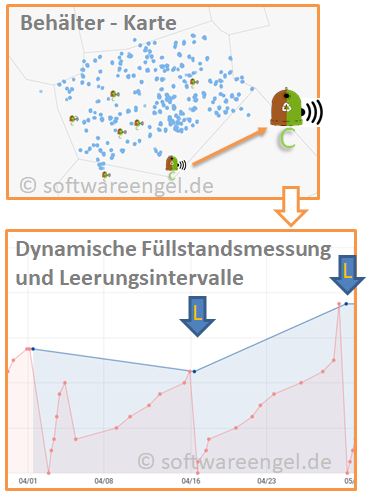
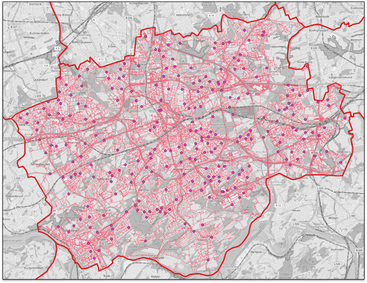
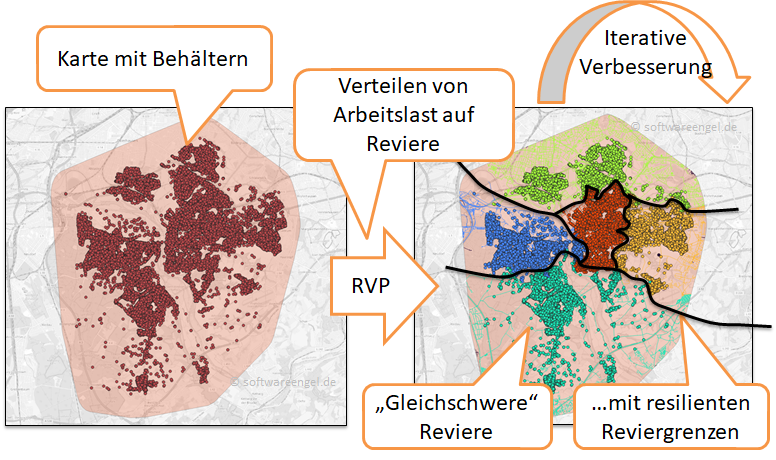
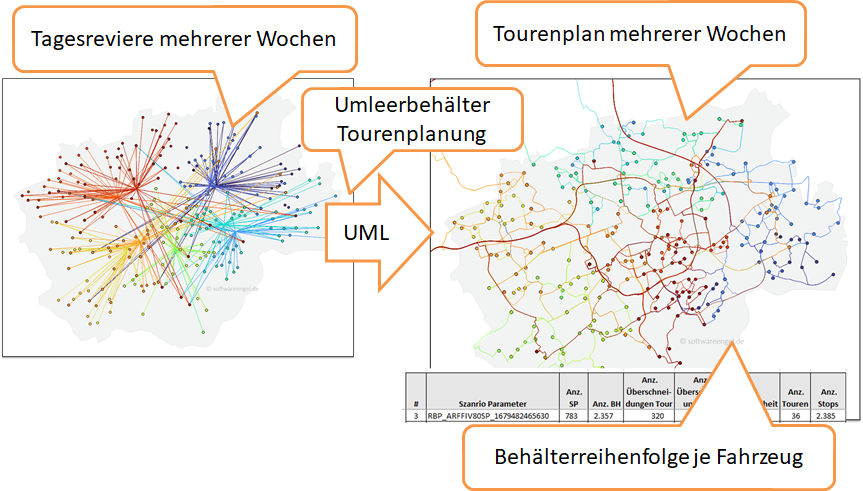
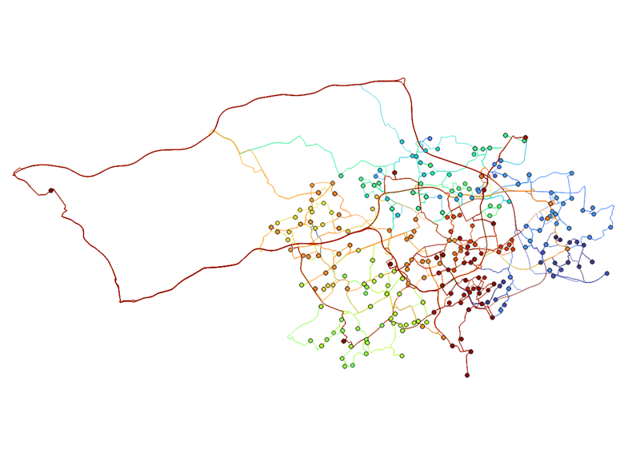

---
layout: post
title: Machbarkeit und Einsparung bei automatischer Depot-Container Revier- und Tourenplanung
categories: []
tags: [Revierplanung, Tourenplanung, Depotcontiner, Behälter, Prognose, Karten, Glas, Depotcontainer]
--- 

## IoT - Integrierte Analyse und Planung von Glas - Depot - Sammelcontanern 
Verschidene Module spielen automatisiert Zusammen 

- IOT - Datensammlung 
- IOT - Daten-Auswertung und Vorhersage 
- Revierplanung mit robusten Reviergrenzen 
- Tagesrevierplanung 
- Routingfähige Karten 

### Skizzen der umgesetzten Idee

### Komponenten des Systems 

### Ablauf des Systems

Alle Module sind automatisierbar (CMM - Level 3)  und auch soweit entwickelt, dass sie über einen "Regler" (Parameter - Tuning) gesteuert werden können (CMM Level 4)!

### CMM - Level - Reifegrad

- <https://www.guru99.com/capability-maturity-model-cmm-cmm-levels-a-fool-s-guide.html>
- <https://en.wikipedia.org/wiki/Capability_Maturity_Model_Integration>

## Sensordaten erfassen Füllstand 
- Jeder Behälter ist mit einem IoT-Sensor versehen 
- jeder Sensor meldet GeoPostion und Füllstand 

## Prognoseverfahren für Befüllungsgeschwindigkeit 

Berücksichtigen von:
- Sammelinseln 
- Verschiedene Fraktionen 
- Standortveränderungen der Sensoren und Behälter 
- Bauchtum, besondere Abweichungen der Befüllung von Containern 

## Individuelle Leerungs-Rhythmen pro Behälter / Container 

Jeder
- Behälter (Variante A: Einzelbehälter-Planung )  
- oder jede Container - Sammelinsel (Variante B: Stellplatzbasierte Planung) 
bekommt einen Abfuhrrhythmus auf Basis der historischen Sensordaten und der Befüllungsgeschwindigkeit 

<!-- 

-->

## VorbereitungRoutingfähige -Karten (einmalig)
- aufbereiten Kartenmaterial pro Planungsgebiet, Straßenabschnitte  
- verheiraten von Behältern und Stellpülätzen
- verheiraten von Stellplätzen und Geo-Positionen (Adressen/ POIs)
- klären von unschärfen und unplausibilitäten

### Aufnahme und Analyse der IST - Situation 

## Erstellung einer Revierplanung mit Revieren mit Reviergrenzen (wabenförmige Struktur)

Automatisches Revierplanungs- Verfahren (RVP- Verfahren):
- automatisches Zuweisen von Behältern zu PLanungsbebieten (sog. Revieren)
- Auswahl: Behälter oder Stelplatzplanung 
- optische Revierprgrenzen, gut für den Planuner und Fahrer erkennbar  
- Prozentuale Verteilung der Arbeitslast auf die Reviere 

## Tageszuweisung der Behälter zu Wochentagen (Tages-Revierplanung: RBP ) 
Rhytmusbasierendes Partitionieren (RBP - Verfahren):
- Auswahl des Planunghorizonts (1,2,3 oder 4 Wochen)
- jeder Behälter wird auf Wochentage im PLanungshorizont verteilt
- Berücksichtigung des Zeitlichen Abstands zwischnen den Bedienungen 
- Im Ergebnis sind alle Wochentage im Planungshorizont und die an diesem Tag zu bedienenden Behälter 
 

## Reihenfolge- Vorschlag für die Anfahrt der Behälter jedes Wochentages im Planungshorizont 

Umleer-Tourenplanung-Verfahren (UML):

- Tourenplanung je Wochentag : Start am Betriebshof - Sammelfahrten - Leerung in der Anlage - evtl. weitere Sammelfahren - Zurück zur Betriebshof
- Bestimmung Planzeiten je Wochentag 
- Vorschlag für den Fahrer

## Tourenoptimierung 

- Aufzeichung der Fahrzeuge je Wochentag im Tagesrevier im Planungshorizont 
- Follow-Me als Vorschlag für Fahrer mit wenig Revier-Kenntnis

