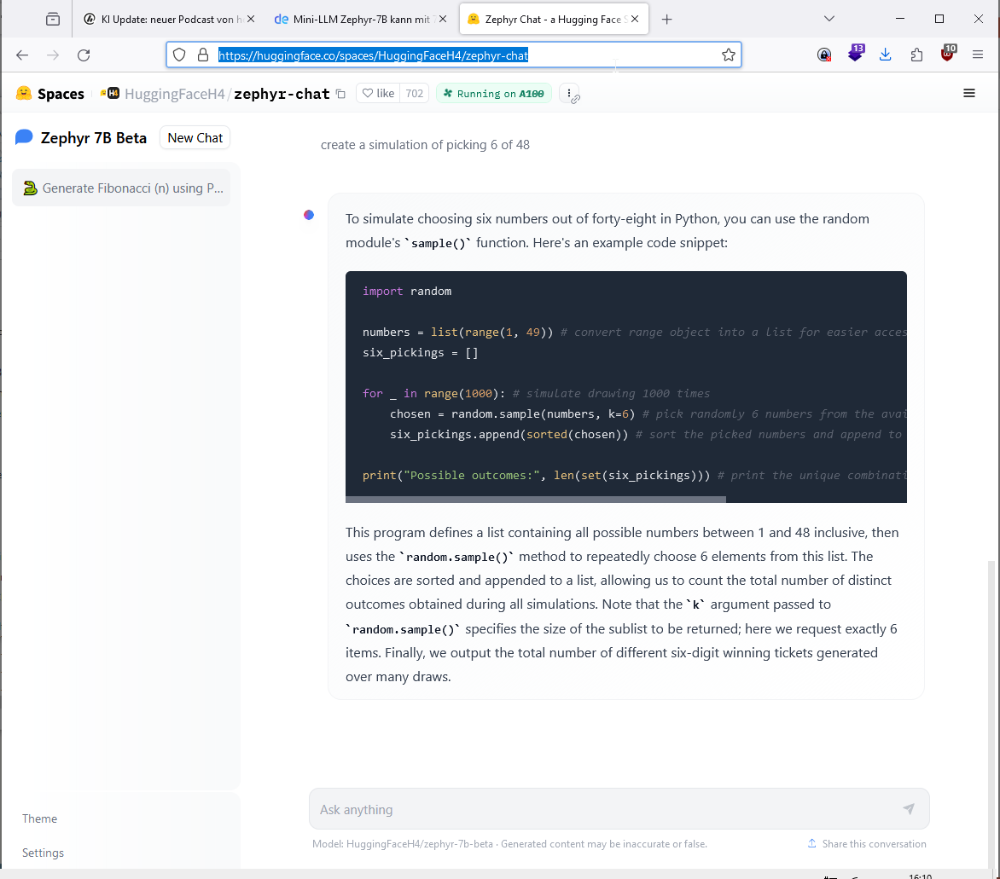
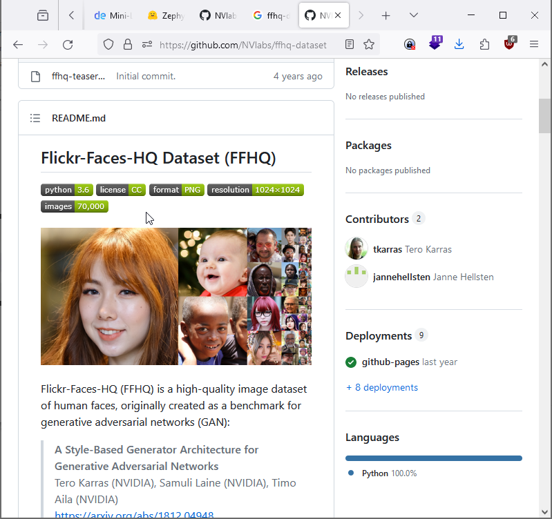
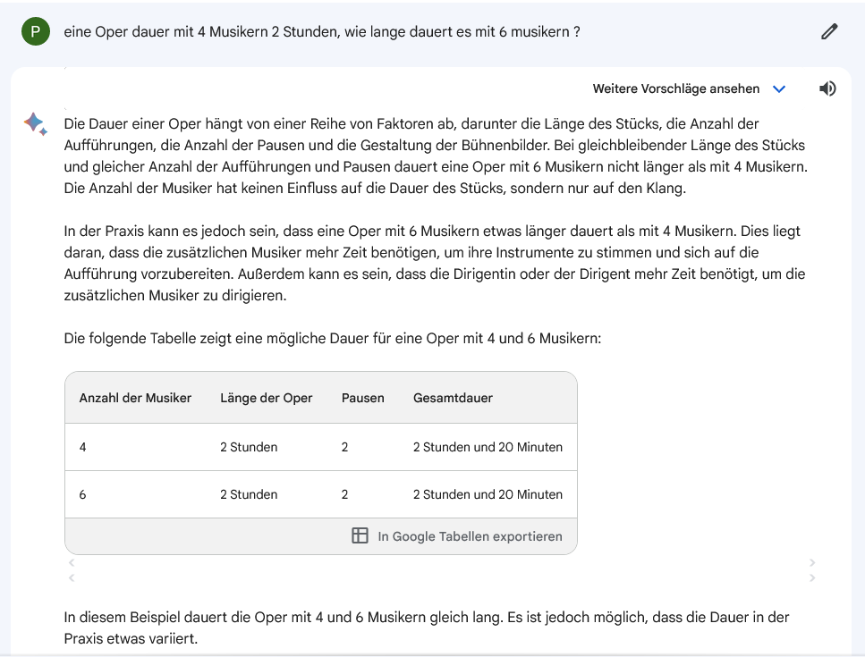
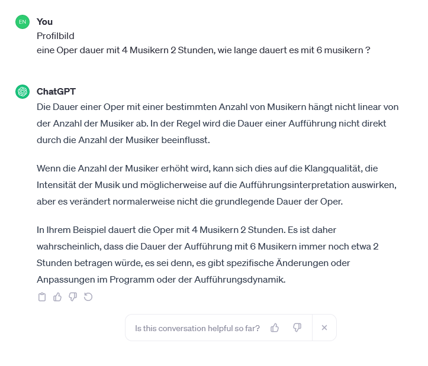

---
layout: post
title: KI update - Backlog
categories: []
tags: [KI, ML, update]
--- 
- [Mini-LLM Zephyr-7B kann mit 70-Milliarden-Parameter-Modellen mithalten](#mini-llm-zephyr-7b-kann-mit-70-milliarden-parameter-modellen-mithalten)
- [Amazon  Titan Image Generator](#amazon--titan-image-generator)
- [ffhq-dataset flickr faces](#ffhq-dataset-flickr-faces)
- [Papers with code](#papers-with-code)
- [KI Suche DE](#ki-suche-de)
- [God Mode AI](#god-mode-ai)
- [Clipdrop](#clipdrop)
- [nvidia lab](#nvidia-lab)
- [Every Noise at Once](#every-noise-at-once)
- [An A.I.-Generated Picture Won an Art Prize. Artists Aren’t Happy.](#an-ai-generated-picture-won-an-art-prize-artists-arent-happy)
- [AI Product Database](#ai-product-database)
- [KI Poscast](#ki-poscast)
- 
- [Mit diesen Daten wurde GPT-3 trainiert](#mit-diesen-daten-wurde-gpt-3-trainiert)
- [Warum Open Source trotz des Closed-Source-Ansatzes von OpenAI die Zukunft gehört](#warum-open-source-trotz-des-closed-source-ansatzes-von-openai-die-zukunft-gehört)
- 

## Mini-LLM Zephyr-7B kann mit 70-Milliarden-Parameter-Modellen mithalten

Hugging Face hat das hochoptimierte Mini-Sprachmodell Zephyr-7B entwickelt, das auf Mistral 7B basiert, einem Open-Source-Modell des europäischen Start-ups Mistral AI. Das Modell wurde mit einer Methode namens Destilled Supervised Fine Tuning (dSFT) verfeinert, bei der die Ausgabe eines größeren "Lehrer"-Modells verwendet wird, um ein kleineres "Schüler"-Modell zu trainieren. Das Verfahren der destillierten direkten Präferenzoptimierung (dDPO) nutzt das KI-Feedback aus einer Reihe von Lehrermodellen als Präferenzdaten, wodurch die Trainingszeit und die benötigten Ressourcen erheblich reduziert werden. Zephyr-7B liegt in Benchmarks knapp vor Mistral 7B und kann sogar an Llama-2 mit 70 Milliarden-Parametern heranreichen. Man kann das Modell hier im Chat testen.

<https://huggingface.co/spaces/HuggingFaceH4/zephyr-chat>

<https://the-decoder.de/mini-llm-zephyr-7b-kann-mit-70-milliarden-parameter-modellen-mithalten/>

## Amazon  Titan Image Generator
https://the-decoder.de/amazons-titan-reihe-enthaelt-jetzt-einen-ki-bildgenerator/ 

Amazon hat den Titan Image Generator vorgestellt, ein KI-Modell, mit dem Entwickler durch Eingabe von Text realistische Bilder in angeblicher

##  ffhq-dataset flickr faces 

FFHQ (Flickr-Faces-HQ) 
<https://paperswithcode.com/dataset/ffhq>

<https://github.com/NVlabs/ffhq-dataset>

## Papers with code 

<https://paperswithcode.com>

## KI Suche DE

Entdecke Deutschlands größte KI-Tool Datenbank

<https://www.advanced-innovation.io/>

## God Mode AI 

Godmode is a web platform to access the automation powers of autoGPT and babyAGI. AI agents are still in their infancy, but they are quickly growing in capabilities, and we hope that Godmode will enable more people to tap into autonomous AI agents even in this early stage.

Godmode is inspired by Auto-GPT and BabyAGI, and supports GPT-3.5 & GPT-4.

<https://godmode.space/>

## Clipdrop

Create stunning visuals in seconds

<https://clipdrop.co/stable-diffusion-turbo>

<https://clipdrop.co/>

## Nvidia lab 

<https://catalog.ngc.nvidia.com/orgs/nvidia/teams/ai-foundation/models/sdxl>

## Every Noise at Once
Every Noise at Once is an ongoing attempt at an algorithmically-generated, readability-adjusted scatter-plot of the musical genre-space, based on data tracked and analyzed for 6,297 genre-shaped distinctions by Spotify as of 2023-11-30. The calibration is fuzzy, but in general down is more organic, up is more mechanical and electric; left is denser and more atmospheric, right is spikier and bouncier.
 
Click anything to hear an example of what it sounds like.
 
Click the » on a genre to see a map of its artists.
 
Be calmly aware that this may periodically expand, contract or combust.

<https://everynoise.com/everyplace.cgi?scope=all&vector=country>

<https://everynoise.com/>

## An A.I.-Generated Picture Won an Art Prize. Artists Aren’t Happy.

“I won, and I didn’t break any rules,” the artwork’s creator says.
<https://www.nytimes.com/2022/09/02/technology/ai-artificial-intelligence-artists.html>

## AI Product Database
At AI Product Database, our mission is to track the latest AI products that can be used by businesses of all sizes. We strive to help the world find the appropriate tools by maintaining the most up-to-date list of AI products and resources for every industry.

Current AI Product Categories

    LLMs and Foundation Models
    AI Writing Assistants
    AI Music
    Text to Speech
    AI Home Remodeling
    AI Note Taking/Digital Assistants
    Legal AI
    AI Image Generation
    AI Video Generation
    Real Estate AI
    Marketing and Sales AI
    AI Safety and Security
    AI Slide Deck Tools 
    AI Developer Tools
    AI Agents
    AI Tutor
    AI Finance Tools
    AI Medical Assistants
    Conversational AI
    AI Fashion
    HR & Recruiting AI
    AI Tools
    Cybersecurity AI Tools

<https://aiproductdb.com/

## KI Poscast 

<https://ki-campus.org/node/556?locale=de>

## 
Hier ist die Übersetzung der gegebenen Prinzipien und Ziele für KI-Anwendungen:

1. **Gesellschaftlich vorteilhaft sein.**
   
   Die erweiterte Reichweite neuer Technologien berührt zunehmend die Gesellschaft als Ganzes. Fortschritte in der KI werden transformative Auswirkungen in einer Vielzahl von Bereichen haben, einschließlich Gesundheitswesen, Sicherheit, Energie, Transport, Fertigung und Unterhaltung. Bei der Überlegung potenzieller Entwicklungen und Anwendungen von KI-Technologien werden wir eine breite Palette sozialer und wirtschaftlicher Faktoren berücksichtigen und voranschreiten, wenn wir glauben, dass die insgesamt wahrscheinlichen Vorteile wesentlich größer sind als die absehbaren Risiken und Nachteile.

   KI verbessert auch unsere Fähigkeit, den Inhalt im großen Maßstab zu verstehen. Wir werden uns bemühen, hochwertige und genaue Informationen mithilfe von KI leicht verfügbar zu machen, und dabei weiterhin kulturelle, soziale und rechtliche Normen in den Ländern, in denen wir tätig sind, respektieren. Und wir werden weiterhin sorgfältig prüfen, wann wir unsere Technologien auf nicht kommerzieller Basis zugänglich machen.

2. **Vermeidung der Schaffung oder Verstärkung von unfairer Voreingenommenheit.**
   
   KI-Algorithmen und Datensätze können faire oder unfair Voreingenommenheiten widerspiegeln, verstärken oder reduzieren. Wir erkennen an, dass es nicht immer einfach ist, faire von unfairer Voreingenommenheit zu unterscheiden, und dass dies je nach Kultur und Gesellschaft unterschiedlich sein kann. Wir werden bestrebt sein, ungerechte Auswirkungen auf Menschen zu vermeiden, insbesondere solche, die mit sensiblen Merkmalen wie Rasse, Ethnizität, Geschlecht, Nationalität, Einkommen, sexueller Orientierung, Fähigkeit und politischer oder religiöser Überzeugung zusammenhängen.

3. **Für Sicherheit entwickelt und getestet werden.**
   
   Wir werden weiterhin starke Sicherheits- und Praktiken anwenden, um unbeabsichtigte Ergebnisse zu vermeiden, die Risiken von Schäden verursachen könnten. Wir werden unsere KI-Systeme angemessen vorsichtig gestalten und versuchen, sie gemäß bewährten Methoden in der KI-Sicherheitsforschung zu entwickeln. In geeigneten Fällen werden wir KI-Technologien in begrenzten Umgebungen testen und ihren Betrieb nach der Bereitstellung überwachen.

4. **Rechenschaftspflichtig gegenüber Menschen sein.**
   
   Wir werden KI-Systeme entwerfen, die angemessene Möglichkeiten für Feedback, relevante Erklärungen und Einspruch bieten. Unsere KI-Technologien unterliegen angemessener menschlicher Anleitung und Kontrolle.

5. **Datenschutzdesignprinzipien einbeziehen.**
   
   Wir werden unsere Datenschutzprinzipien in die Entwicklung und Nutzung unserer KI-Technologien einbeziehen. Wir werden Gelegenheit zur Benachrichtigung und Zustimmung geben, Architekturen mit Datenschutzvorkehrungen fördern und angemessene Transparenz und Kontrolle über die Verwendung von Daten bieten.

6. **Hohe Standards wissenschaftlicher Exzellenz aufrechterhalten.**
   
   Technologische Innovation basiert auf dem wissenschaftlichen Ansatz und einem Engagement für offene Untersuchung, intellektuelle Strenge, Integrität und Zusammenarbeit. KI-Tools haben das Potenzial, neue Bereiche wissenschaftlicher Forschung und Kenntnisse in wichtigen Bereichen wie Biologie, Chemie, Medizin und Umweltwissenschaften zu erschließen. Wir streben hohe Standards wissenschaftlicher Exzellenz an, während wir die Entwicklung von KI vorantreiben.

   Wir werden mit verschiedenen Interessengruppen zusammenarbeiten, um eine durchdachte Führung in diesem Bereich zu fördern, und uns dabei auf wissenschaftlich rigorose und multidisziplinäre Ansätze stützen. Und wir werden verantwortungsbewusst KI-Wissen teilen, indem wir Bildungsmaterialien, bewährte Verfahren und Forschung veröffentlichen, die es mehr Menschen ermöglichen, nützliche KI-Anwendungen zu entwickeln.

7. **Für Anwendungen verfügbar sein, die mit diesen Prinzipien im Einklang stehen.**
   
   Viele Technologien haben mehrere Anwendungen. Wir werden versuchen, potenziell schädliche oder missbräuchliche Anwendungen zu begrenzen. Bei der Entwicklung und Bereitstellung von KI-Technologien werden wir voraussichtliche Verwendungen im Hinblick auf folgende Faktoren bewerten:

    - Hauptzweck und Verwendung: Der Hauptzweck und die wahrscheinliche Verwendung einer Technologie und Anwendung, einschließlich der Nähe oder Anpassbarkeit der Lösung für eine schädliche Verwendung.
    - Natur und Einzigartigkeit: Ob wir Technologien zur Verfügung stellen, die einzigartig oder allgemeiner verfügbar sind.
    - Skalierung: Ob die Verwendung dieser Technologie erhebliche Auswirkungen haben wird.
    - Art der Beteiligung von Google: Ob wir allgemeine Tools bereitstellen, Tools für Kunden integrieren oder kundenspezifische Lösungen entwickeln.

## Mit diesen Daten wurde GPT-3 trainiert

Gerüchteweise hat das Training von GPT-3 13 Mio Dollar verschlungen.

<https://katzlberger.ai/2021/04/12/mit-diesen-daten-wurde-gpt-3-trainiert/>

<https://www.kdnuggets.com/2020/06/gpt-3-deep-learning-nlp.html>

## Warum Open Source trotz des Closed-Source-Ansatzes von OpenAI die Zukunft gehört

<https://ki-campus.org/blog/open-source-sprachmodelle>

## 

<https://ml-course.github.io/master/notebooks/08%20-%20Neural%20Networks.html>

<https://www.asimovinstitute.org/neural-network-zoo/>

## Pouff - Grocery Trip

<https://www.youtube.com/watch?v=DgPaCWJL7XI>

## py notebooks 

<https://learn.ki-campus.org/courses/dali-datamining-THK2021/items/2feKFImgpcfc8mHOd4Pm78>

## bard 

## chatgpt musiker 

## Lernkurse KI 

- Das Lernangebot „Einführung in die KI“ Applied-AI-Initiative, Anbieter: KI-Campus <https://ki-campus.org/courses/einfuehrungki2020>

- Elements of AI , Universität Helsinki <http://www.elementsofai.de/>

- Introduction to Generative AI <https://www.cloudskillsboost.google/course_templates/536>

- Pinar Seyhan Demirdag, „Was ist Generative KI?“ , Anbieter: Linkedin Learning: <https://www.linkedin.com/learning/was-ist-generative-ki-22860708/generative-ki-ein-hilfreiches-werkzeug-fur-die-menschheit>

- Generative KI für jeden,  Andrew Ng. <https://www.deeplearning.ai/courses/generative-ai-for-everyone/>

- ChatGPT, Midjourney, Firefly, Bard, DALL-E , Phil Ebner / Udemy <https://www.udemy.com/course/chatgpt-midjourney-google-bard-dall-e-ai-course/>
- Introduction to Responsible AI, <https://www.cloudskillsboost.google/course_templates/554>

- ChatGPT: Was bedeutet generative KI für unsere Gesellschaft? <https://open.hpi.de/courses/kizukunft2023>

- Grundlagen des Prompt Engineering <https://www.deeplearning.ai/short-courses/chatgpt-prompt-engineering-for-developers/>

- Harvards Einführung in KI mit Python, CS50's Introduction to Artificial Intelligence with Python - May 2023 <https://pll.harvard.edu/course/cs50s-introduction-artificial-intelligence-python/2023-05>

- Harvard Data Science: Machine Learning <https://pll.harvard.edu/course/data-science-machine-learning>

- Microsofts Arbeitsoptimierung mit Microsoft Bing Chat <https://www.linkedin.com/learning/ihre-arbeit-optimieren-mit-microsoft-bing-chat/so-kann-bing-chat-sie-in-ihrem-arbeitsalltag-unterstutzen>

- Amazons Gen-KI-Lernplan für Entscheidungsträger <https://explore.skillbuilder.aws/learn/public/learning_plan/view/1909/generative-ai-learning-plan-for-decision-makers>